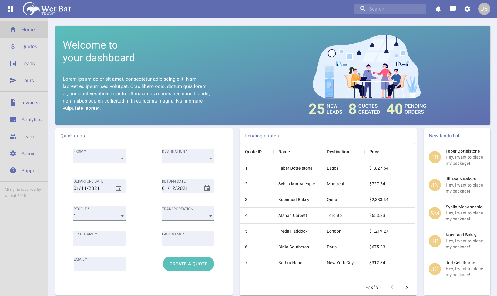
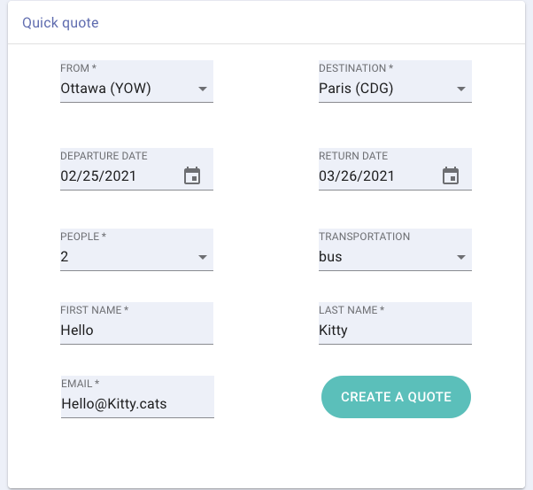
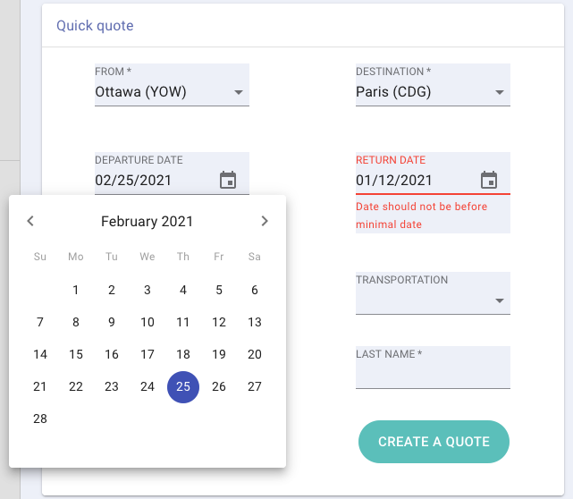
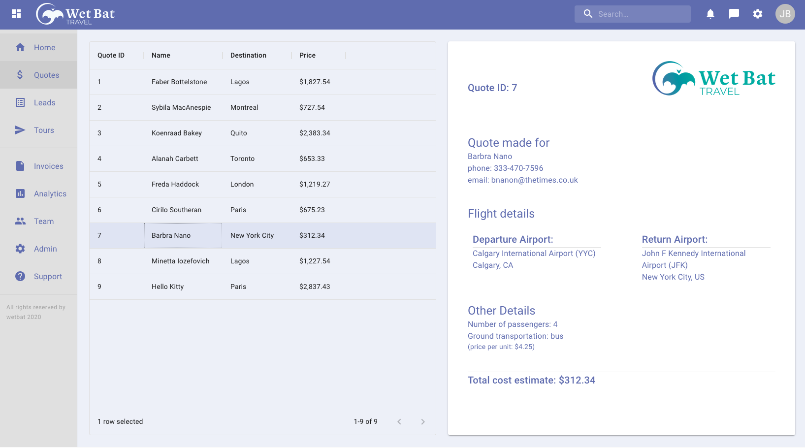

# WET BAT

A desktop app for travel agents to quickly create and manage quotes

## Setup

### Back-end

First, navigate into the back-end directory

```sh
cd path/to/wet_bat/back-end
```

Create Postgres database instance with PSQL

```sh
createdb wetbat
```

Create environment file .env

```sh
touch .env
```

Copy the following variables into .env

`DB_HOST=localhost`

`DB_NAME=wetbat`

`DB_PORT=5432`

Download node dependencies in the back-end

```sh
yarn # npm install
```

Run the migrations to create the tables and seed the database by running:

```sh
yarn db:reset
```

### Front-end

Navigate into the front-end directory

```sh
cd path/to/wet_bat/front-end
```

Install dependencies

```sh
yarn # npm install
```

## Running the application

1. Start the server on the back-end

```sh
cd path/to/wet_bat/back-end
yarn start # npm run start
```

2. Start the front-end

```sh
cd path/to/wet_bat/front-end
yarn start # npm run start
```

## Screenshots

home page dashboard view



quick quote form



date validation on form



view of the quotes tab with the quotes list on the left and an individual quote rendered on the right



demo


## Notes about my process

#### Captain's Log

- I was not yet familiar with Material UI so I began this project by building out the front end nav and sidebar structures to get acquainted.

- Since this was new to me, it was a slow start. Looking back over my code, there is repetition in the jsx. I didn't have time to refactor it, but I did take the time to modularize the QuoteForm component into smaller input Components and map elements where appropriate.

- After I got the structure of the front figured out, I moved to the database

- I created four tables, only bringing in the data needed for this specific task.

- My first approach to using airport data was to pull real data online into a csv file. I could not figure out how to seed this data into the db with a relative path for other users (I could only get it to work with a direct path from my computer), so in the end, I copied over a small sample of airports to seed the database.

- From there, I worked to make a connection from the front to the back so information could be pulled and input from the front end. Since this project is small in scope, I pulled in all the data to the front, rather than making specific queries for data. If this were a larger scale, I imagine I'd need to rethink that strategy.

- In general, I am more comfortable with the front end. However, in this project I struggled to get Material UI to behave in the ways I thought it would while pulling in data, which proved time consuming. I'm glad I used it because my hope is that next time, I'll be savvier with it :)

- My goal was to use TypeScript but given the time constraints and other obstacles, I wound up using JS.
